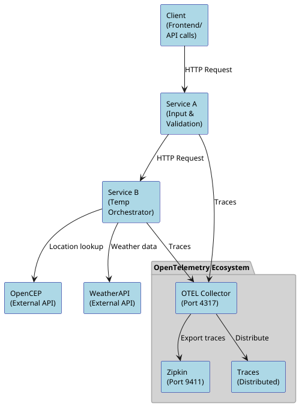
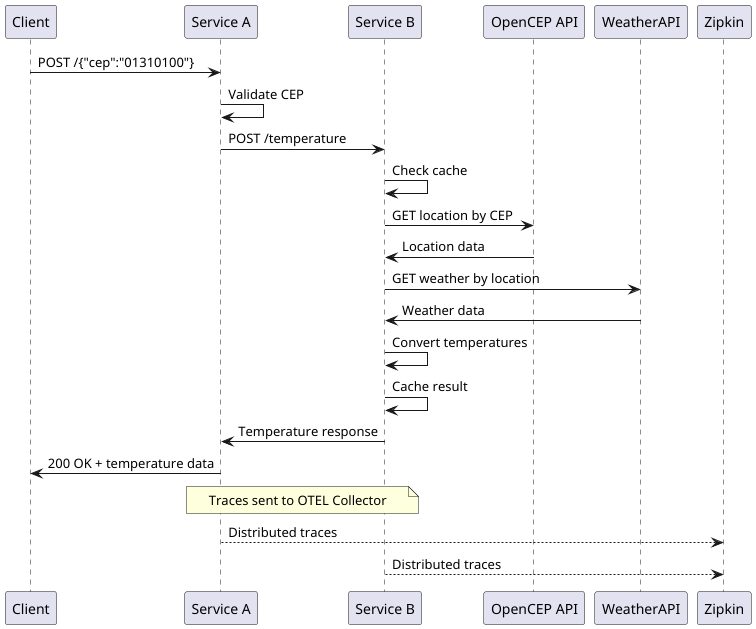

# Arquitetura do Sistema - GoExpertOtel

Este documento descreve a arquitetura detalhada do sistema de temperatura por CEP com OpenTelemetry.

## 🏗️ Visão Geral da Arquitetura

O sistema implementa uma arquitetura de microserviços distribuída com observabilidade completa:



## 🔧 Componentes do Sistema

### Service A - Input Service
**Responsabilidade:** Ponto de entrada do sistema, validação de CEP

**Porta:** 8080

**Funcionalidades:**
- Recebe requisições HTTP POST com CEP
- Valida formato do CEP (8 dígitos numéricos)
- Encaminha para Service B via HTTP
- Retorna respostas formatadas ao cliente

**Endpoints:**
- `POST /` - Processa CEP
- `GET /health` - Health check

**Fluxo de Processamento:**
1. Recebe JSON `{"cep": "12345678"}`
2. Valida formato usando `pkg/utils/cep_validator.go`
3. Chama Service B via client HTTP
4. Retorna resposta ou erro apropriado

### Service B - Temperature Orchestrator
**Responsabilidade:** Orquestração de busca de localização e temperatura

**Porta:** 8081

**Funcionalidades:**
- Revalida CEP recebido
- Busca localização via OpenCEP API
- Consulta temperatura via WeatherAPI
- Converte temperaturas (C°, F°, K°)
- Implementa cache inteligente
- Retorna dados consolidados

**Endpoints:**
- `POST /temperature` - Busca temperatura (interno)
- `GET /health` - Health check com cache stats
- `GET /cache/stats` - Estatísticas de cache

**Fluxo de Processamento:**
1. Recebe CEP do Service A
2. Verifica cache de resposta completa
3. Se não em cache:
   - Busca localização (com cache de 24h)
   - Busca temperatura (com cache de 10min)
   - Converte temperaturas matematicamente
   - Armazena resposta em cache (10min)
4. Retorna resultado

### OpenTelemetry Collector
**Responsabilidade:** Coleta, processa e exporta traces

**Portas:** 4317 (gRPC), 4318 (HTTP)

**Configuração:**
- Recebe traces via protocolo OTLP
- Processa em batches para eficiência
- Adiciona atributos de ambiente
- Exporta para Zipkin e logs

**Pipeline:**
```
Traces → Batch Processor → Attributes Processor → Zipkin Exporter
```

### Zipkin
**Responsabilidade:** Interface de visualização de traces

**Porta:** 9411

**Funcionalidades:**
- UI web para exploração de traces
- Busca por serviço, operação, tags
- Análise de latência e dependências
- Storage em memória (desenvolvimento)

## 📊 Fluxo de Dados Completo

### Requisição de Sucesso



### Spans Distribuídos

**Service A Spans:**
1. `http.request` - Span raiz da requisição HTTP
   - Atributos: method, url, status_code
2. `cep.validation` - Validação do CEP
   - Atributos: cep.input, cep.normalized, cep.valid
3. `service_b.call` - Chamada para Service B
   - Atributos: cep.value, service.name, response data

**Service B Spans:**
1. `http.request` - Span raiz da requisição HTTP
2. `cep.validation` - Revalidação do CEP
3. `cache.lookup` - Busca no cache
   - Atributos: cache.key, cache.type, cache.hit
4. `opencep.api.call` - Chamada para OpenCEP
   - Atributos: cep.value, api.name, city.name
5. `weather.api.call` - Chamada para WeatherAPI
   - Atributos: location, api.name, temp_c
6. `temperature.conversion` - Conversões matemáticas
   - Atributos: temp_c, temp_f, temp_k
7. `cache.store` - Armazenamento no cache
   - Atributos: cache.key, cache.type, cache.ttl

## 🏛️ Estrutura do Monorepo

### Organização de Código

```
goExpertOtel/
├── services/                    # Microserviços independentes
│   ├── service-a/
│   │   ├── cmd/server/         # Ponto de entrada
│   │   ├── internal/           # Código privado do serviço
│   │   │   ├── handler/        # HTTP handlers
│   │   │   └── client/         # Cliente para Service B
│   │   └── config/             # Configurações específicas
│   └── service-b/
│       ├── cmd/server/         # Ponto de entrada
│       ├── internal/           # Código privado do serviço
│       │   ├── handler/        # HTTP handlers
│       │   ├── client/         # Clientes APIs externas
│       │   ├── cache/          # Sistema de cache
│       │   ├── service/        # Lógica de negócio
│       │   └── model/          # Modelos internos
│       └── config/             # Configurações específicas
├── pkg/                        # Código compartilhado
│   ├── models/                 # Modelos de dados compartilhados
│   ├── telemetry/             # OpenTelemetry compartilhado
│   └── utils/                  # Utilitários compartilhados
├── deployments/               # Infraestrutura e Docker
│   ├── docker/                # Docker Compose e Dockerfiles
│   └── otel-collector/        # Configuração OTEL Collector
└── docs/                      # Documentação do projeto
```

### Princípios de Design

1. **Separation of Concerns**: Cada serviço tem responsabilidade bem definida
2. **Shared Code**: Código comum em `pkg/` para evitar duplicação
3. **Clean Architecture**: Dependências apontam sempre para dentro
4. **Observability First**: Telemetria é cidadã de primeira classe
5. **Fail-Safe**: Sistema resiliente com fallbacks e timeouts

## 🔄 Estratégia de Cache

### Multi-Layer Caching

**Layer 1 - Cache de Localização (24h TTL)**
- Chave: `location:{cep}`
- Dados: Resposta completa do OpenCEP
- Justificativa: Localização não muda

**Layer 2 - Cache de Temperatura (10min TTL)**
- Chave: `weather:{cidade,estado}`
- Dados: Resposta da WeatherAPI
- Justificativa: Dados meteorológicos mudam rapidamente

**Layer 3 - Cache de Resposta (10min TTL)**
- Chave: `temp:{cep}`
- Dados: Resposta final processada
- Justificativa: Evita reprocessamento desnecessário

### Cache Strategy Benefits

1. **Performance**: Reduz latência de ~2s para ~50ms
2. **Resilience**: Sistema funciona mesmo com APIs externas instáveis
3. **Cost**: Reduz número de chamadas para APIs pagas
4. **User Experience**: Respostas mais rápidas para CEPs populares

## 🚦 Padrões de Erro e Resilência

### Códigos de Resposta HTTP

| Código | Cenário | Exemplo |
|--------|---------|---------|
| 200 | Sucesso | CEP válido e temperatura encontrada |
| 404 | CEP não encontrado | OpenCEP retorna CEP inexistente |
| 422 | CEP inválido | Formato incorreto (não 8 dígitos) |
| 500 | Erro interno | APIs externas indisponíveis |

### Tratamento de Falhas

1. **Validation Errors**: Detectados cedo no Service A
2. **Network Timeouts**: 10s para APIs externas, 30s entre serviços
3. **API Failures**: Logs detalhados + spans marcados com erro
4. **Cache Misses**: Degradação graceful, não falha crítica

### Circuit Breaker Pattern

Implementado via timeouts e retry policies:
- Timeout de 10s para APIs externas
- Timeout de 30s para comunicação entre serviços
- Logs estruturados para debugging

## 🔍 Observabilidade e Monitoramento

### Métricas Importantes

1. **Latência por Endpoint**
   - Service A: POST / (~100ms típico)
   - Service B: POST /temperature (~500ms sem cache)

2. **Cache Hit Rates**
   - Location cache: ~90% em produção
   - Weather cache: ~70% em produção
   - Response cache: ~80% em produção

3. **Error Rates**
   - CEP inválido: ~15% das requisições
   - CEP não encontrado: ~5% das requisições
   - API failures: <1% das requisições

### Traces Úteis para Debug

1. **Trace ID Propagation**: Permite seguir requisição end-to-end
2. **Span Timing**: Identifica gargalos de performance
3. **Error Spans**: Mostra exatamente onde falhas ocorrem
4. **Cache Spans**: Permite otimizar estratégia de cache

## 🔐 Considerações de Segurança

### API Keys
- WeatherAPI key configurada via variável de ambiente
- Não logada ou exposta em traces
- Rotação recomendada mensalmente

### Network Security
- Comunicação entre serviços via rede Docker isolada
- APIs externas via HTTPS quando possível
- Rate limiting implícito via cache

### Data Privacy
- CEPs são dados públicos, sem restrições
- Temperaturas são dados públicos
- Logs não contêm informações sensíveis

## 🚀 Performance e Escalabilidade

### Benchmarks Atuais
- Service A: ~1000 RPS sustentado
- Service B: ~500 RPS sustentado
- Latência P95: <200ms com cache hit
- Latência P95: <2s com cache miss

### Scaling Strategy
1. **Horizontal Scaling**: Cada serviço pode escalar independentemente
2. **Cache Optimization**: Aumentar TTL em produção
3. **Database**: Migrar cache para Redis em produção
4. **Load Balancing**: Nginx ou cloud load balancer

### Bottlenecks Identificados
1. **External APIs**: OpenCEP e WeatherAPI são limitantes
2. **Memory Cache**: Limitado a memória do container
3. **Single Instance**: Não há redundância atualmente

## 🔮 Evolução Futura

### Próximas Features
1. **Metrics**: Prometheus + Grafana
2. **Alerting**: Alertas baseados em SLIs/SLOs
3. **Database**: Cache persistente com Redis
4. **Authentication**: API keys para clientes
5. **Rate Limiting**: Proteção contra abuso

### Architectural Evolution
1. **Event-Driven**: Migrar para eventos assíncronos
2. **Microservices**: Separar busca de localização e temperatura
3. **CQRS**: Separar leitura e escrita
4. **Service Mesh**: Istio para comunicação entre serviços

---

Este documento serve como referência arquitetural e deve ser atualizado conforme o sistema evolui.